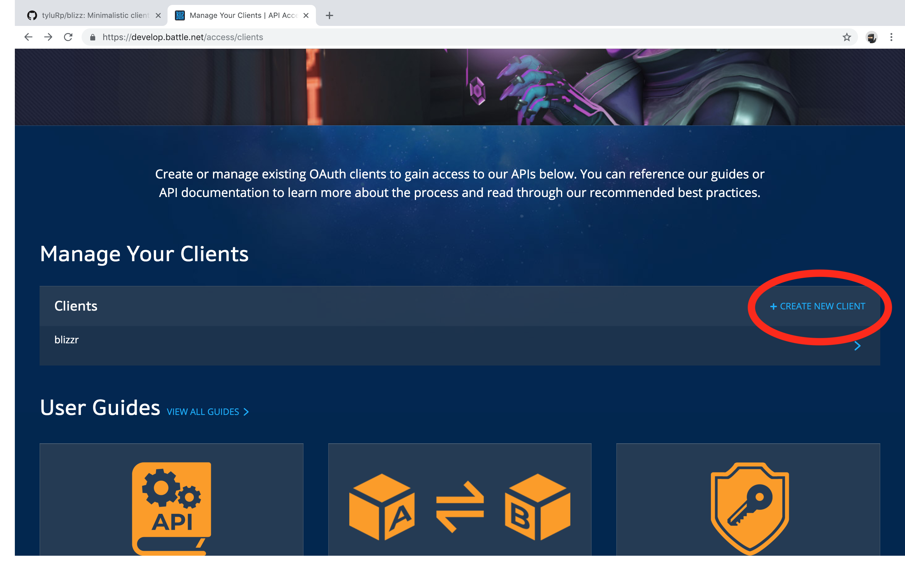
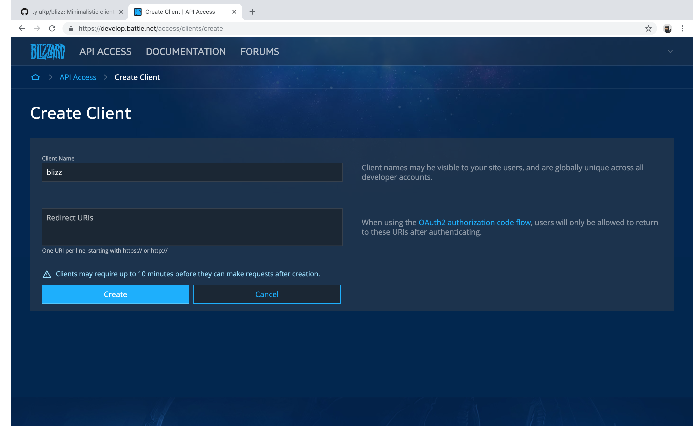
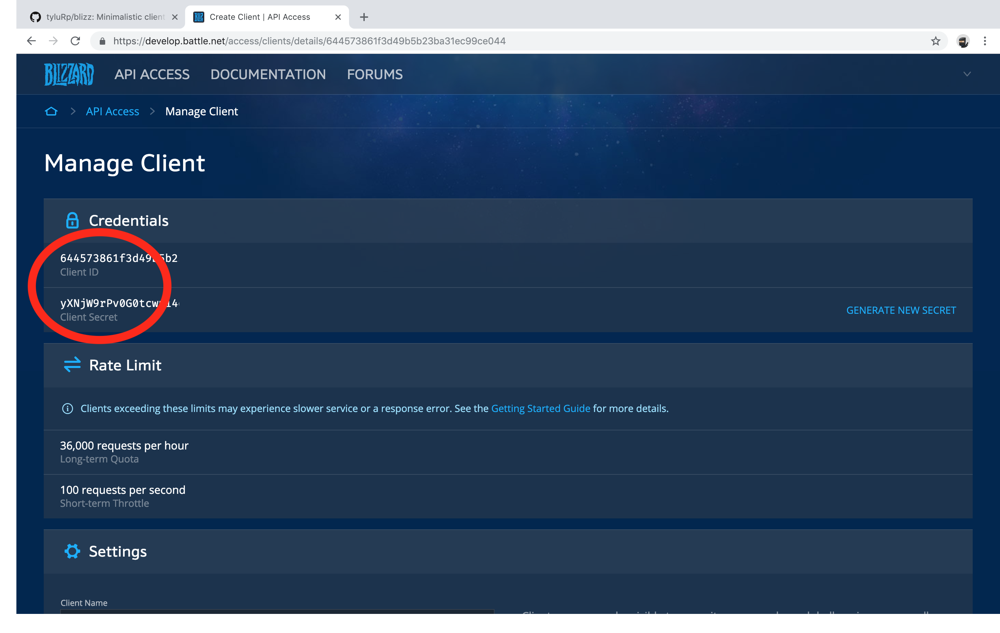

```{r, include = FALSE}
knitr::opts_chunk$set(
  collapse = TRUE,
  comment = "#>"
)
```

In this vignette, we go over how to authenticate so that we can start using `blizz`.

### Step 1: Create an account

I'm going to gloss over this part because I already have an account. Go to https://develop.battle.net/ and create an account. You will also need to download Blizzard's authenticator app, the [iOS](https://itunes.apple.com/us/app/blizzard-authenticator/id306862897?mt=8) version and the [Android](https://play.google.com/store/apps/details?id=com.blizzard.bma&hl=en_US) version are available to download.

Once you've:

1. Created an account at https://develop.battle.net/
2. Downloaded and logged into the authenticator app

You can login to https://develop.battle.net/. A notification on the authenticator app will prompt you to approve the login and you're good to go. You're ready to proceed to the next step and create a client.

### Step 2: Create a client

Next, we need to create a client. All we want from the client are:

1. A **Client ID**
2. A **Client Secret**

Those two things will allow us to obtain a **Access Token** which we need to make requests to the API.

```{r, echo=FALSE}

```

Then give it a title, no need to worry about the Redirect URIs.

```{r, echo=FALSE}

```

After the client is created, you'll see the **ID** and **Secret**. The screenshot is just a test one I'm making for this vignette, the last 6 or so characters were cut off so yours should look a bit longer.

```{r, echo=FALSE}

```

### Step 3

Finally, we run the following command in R:

```r
library(blizz)

blizz_auth(client_id, client_secret)
```

From this point you should be able to make requests. Access tokens expire after 24 hours so you will eventually need to run:

```r
blizz_auth(refresh = TRUE)
```
